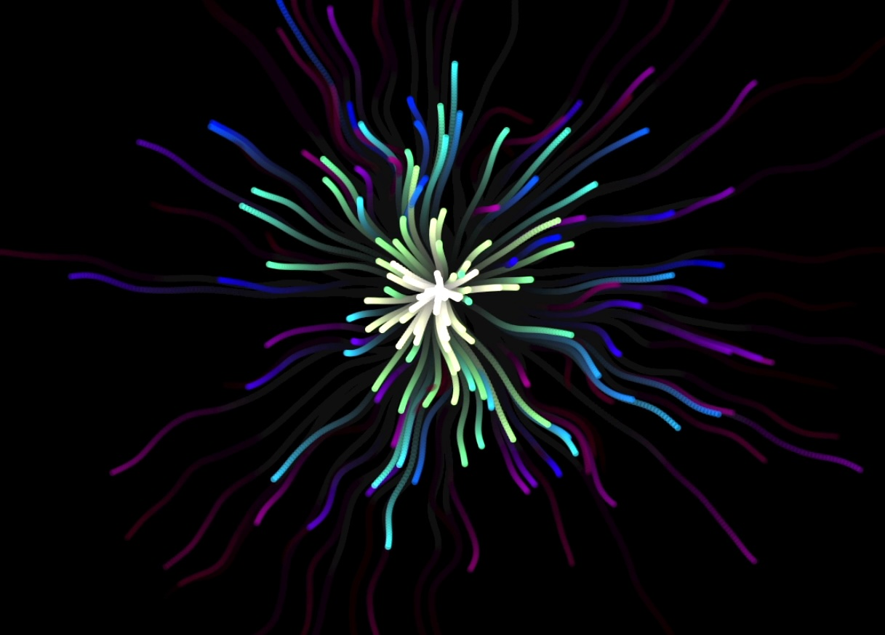

# Particle Flow Simulation from Scratch

A simple JavaScript application that simulates particle flow using curl noise. It creates a sweet visual effect where particles move in a fluid-like manner across the canvas.



## Features

- **Dynamic Particle System**: Particles are continuously emitted and updated.
- **Curl Noise Integration**: Uses curl noise to influence particle trajectories, creating smooth and natural motion.
- **Canvas Rendering**: Utilizes the HTML5 Canvas API for rendering particles. No other libraries.

## Demo

You can view a live demo of the project [here](https://yourusername.github.io/particle-flow-simulation/).

## Getting Started

### Prerequisites

- A modern web browser (Chrome, Firefox, Safari, Edge)
- Basic knowledge of HTML, CSS, and JavaScript

### Installation

1. **Clone the Repository**

   ```bash
   git clone https://github.com/yourusername/particle-flow-simulation.git
   cd particle-flow-simulation
   ```

2. **Install Dependencies**

   Ensure you have the `curl.js` library in the `libs` directory, which provides the `getCurl` function.

### Running the Project

Open the `index.html` file in your web browser:

```bash
open index.html
```

Alternatively, you can use a local development server:

```bash
# Using Node.js and http-server
npm install -g http-server
http-server

# Then navigate to http://localhost:8080 in your browser
```

## Customization

You can tweak various parameters in `main.js` to customize the simulation:

- **Particle Size and Fade Rate**

  ```javascript
  let size = 4;        // Particle size
  const fadeRate = 0.005; // Rate at which particles fade
  ```

- **Noise Parameters**

  ```javascript
  const noiseForce = 1;    // Influence of noise on particles
  const noiseScale = 0.01; // Scale of the noise field
  ```

- **Emitter Settings**

  ```javascript
  const maxParticles = 500; // Maximum number of particles
  ```

- **Animation Speed**

  ```javascript
  const timeMult = 0.0002; // Multiplier for time progression
  ```

## Contributing

Contributions are welcome!

